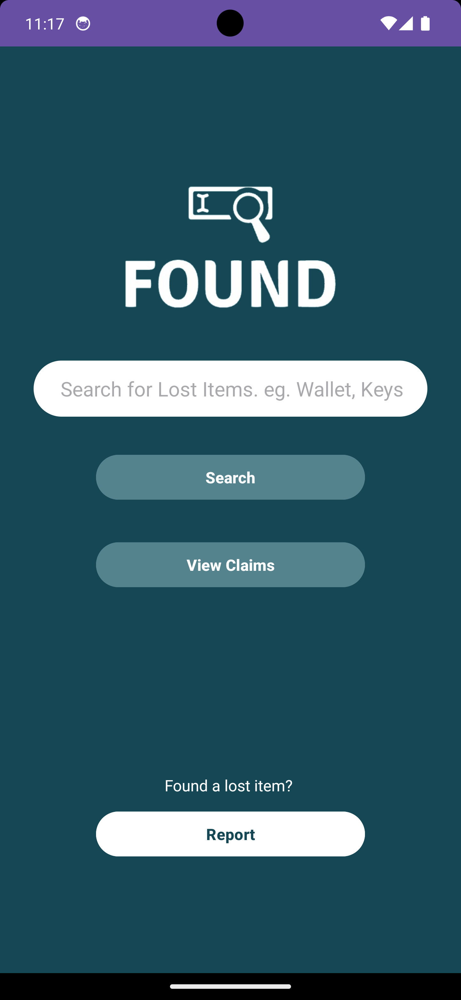
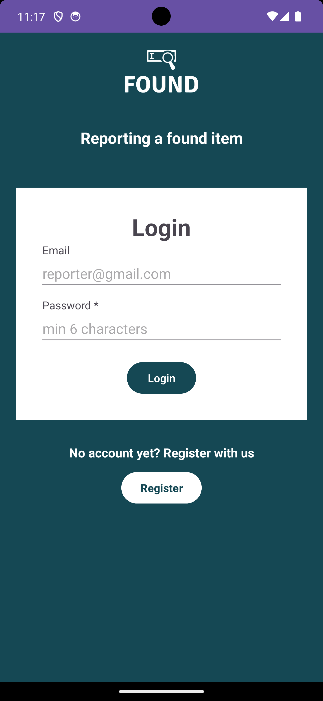
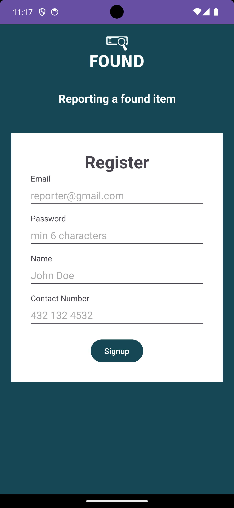
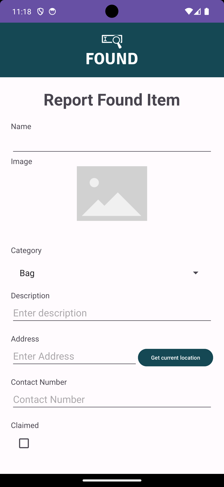
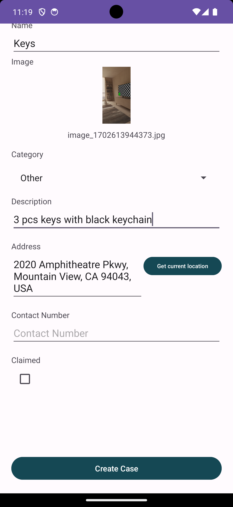
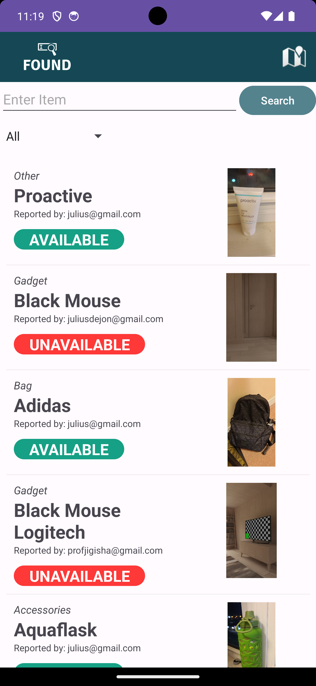
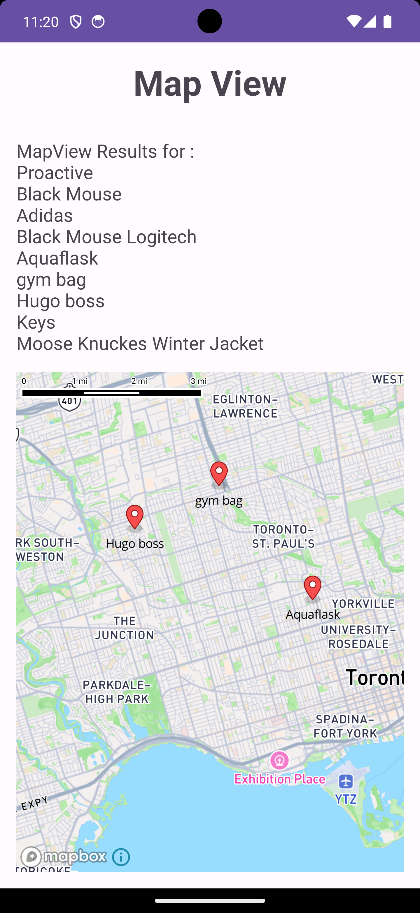
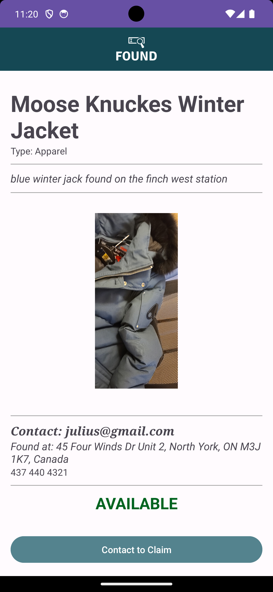

# Lost and Found App made in Android(Kotlin)

# Features
- Sign up / Sign In as Reporter, Claimant, or Guest
- Browse for found items
- Report a lost item
- Filter by category
- Search by Map View
- Contact the Reporter
- View Lost item in detail

# Services, Dependancies, and Architecture
- Firebase firestore
- Firebase storage (storing of images)
- Firebase Authentication (email and password)
- Android Jetpack architecture pattern with added controllers
- MVC architecture
- MapBox

# Author
- Julius Dejon
- Leo Alcordo
- Sankarnath Suresh

# Screenshots

  

